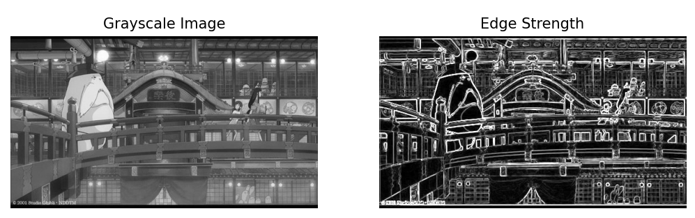

# L05_Edge and Region_Homework

## 01 **소벨 에지 검출 및 결과 시각화**

### 요구사항

- `cv.Sobel()`을 사용하여 x방향과 y방향의 소벨 필터 적용
- `cv.magnitude()`를 사용하여 에지 강도 계산
- `cv.convertScaleAbs()`를 사용하여 결과를 8비트 정수형으로 변환
- `matplotlib.pyplot`을 사용하여 원본 그레이스케일 이미지와 에지 강도를 시각화

### 코드

```python
import cv2 as cv
import matplotlib.pyplot as plt

# 이미지 로드 및 그레이스케일 변환
img = cv.imread('edgeDetectionImage.jpg')
gray = cv.cvtColor(img, cv.COLOR_BGR2GRAY)

# 소벨 필터 적용
sobel_x = cv.Sobel(gray, cv.CV_64F, 1, 0, ksize=3)
sobel_y = cv.Sobel(gray, cv.CV_64F, 0, 1, ksize=3)

# 에지 강도 계산
edge_strength = cv.magnitude(sobel_x, sobel_y)
edge_strength = cv.convertScaleAbs(edge_strength)  # uint8 변환

# 결과 시각화
plt.figure(figsize=(10, 5))
plt.subplot(1, 2, 1)
plt.imshow(gray, cmap='gray')
plt.title('Grayscale Image')
plt.axis('off')

plt.subplot(1, 2, 2)
plt.imshow(edge_strength, cmap='gray')
plt.title('Edge Strength')
plt.axis('off')

plt.show()
```

### 코드 설명

### (1) 이미지 불러오기 및 그레이스케일 변환

```python
img = cv.imread('edgeDetectionImage.jpg')
gray = cv.cvtColor(img, cv.COLOR_BGR2GRAY)
```

- `cv.imread()`를 사용해 이미지를 불러온다.
- `cv.cvtColor()`를 사용하여 컬러 이미지를 그레이스케일로 변환한다.

### (2) 소벨 필터 적용

```python
sobel_x = cv.Sobel(gray, cv.CV_64F, 1, 0, ksize=3)
sobel_y = cv.Sobel(gray, cv.CV_64F, 0, 1, ksize=3)
```

- `cv.Sobel()`을 사용하여 x 방향(`dx=1, dy=0`)과 y 방향(`dx=0, dy=1`)에 대한 미분을 계산한다.
- `cv.CV_64F`를 사용하여 결과를 64비트 부동소수점(float64)으로 저장한다.

### (3) 에지 강도 계산

```python
edge_strength = cv.magnitude(sobel_x, sobel_y)
edge_strength = cv.convertScaleAbs(edge_strength)  # uint8 변환
```

- `cv.magnitude()`를 사용하여 소벨 필터 결과를 기반으로 에지 강도를 계산한다.
- `cv.convertScaleAbs()`를 사용하여 결과를 `uint8` 타입으로 변환하여 시각화가 가능하도록 만든다.

### (5) 결과 시각화

```python
plt.figure(figsize=(10, 5))
plt.subplot(1, 2, 1)
plt.imshow(gray, cmap='gray')
plt.title('Grayscale Image')
plt.axis('off')

plt.subplot(1, 2, 2)
plt.imshow(edge_strength, cmap='gray')
plt.title('Edge Strength')
plt.axis('off')

plt.show()
```

- `plt.subplot()`을 사용하여 원본 이미지와 에지 강도 이미지를 나란히 출력한다.
- `cmap='gray'`를 지정하여 이미지를 흑백으로 출력한다.

### 실행 결과



- **Grayscale Image**: 원본 이미지를 그레이스케일로 변환한 결과
- **Edge Strength**: 소벨 필터를 적용하여 계산한 에지 강도 이미지

위 과정을 통해 이미지의 경계를 효과적으로 감지할 수 있다.

## 02 **캐니 에지 및 허프 변환을 이용한 직선 검출**

### 요구사항

- `cv.Canny()`를 사용하여 에지 맵을 생성한다.
- `cv.HoughLinesP()`를 사용하여 직선을 검출한다.
- `cv.line()`을 사용하여 검출된 직선을 원본 이미지에 표시한다.
- `matplotlib.pyplot`을 사용하여 원본 이미지와 직선이 그려진 이미지를 나란히 시각화한다.

### 코드

```python
import cv2 as cv
import numpy as np
import matplotlib.pyplot as plt

# 이미지 로드 및 그레이스케일 변환
img = cv.imread('dabotap.jpg')
img_copy = img.copy()
gray = cv.cvtColor(img_copy, cv.COLOR_BGR2GRAY)

# 캐니 에지 검출
edges = cv.Canny(gray, 100, 200)

# 허프 변환을 이용한 직선 검출
lines = cv.HoughLinesP(edges, rho=0.5, theta=np.pi/360, threshold=30, minLineLength=30, maxLineGap=5)

# 검출된 직선을 원본 이미지에 표시
if lines is not None:
    for line in lines:
        x1, y1, x2, y2 = line[0]
        cv.line(img_copy, (x1, y1), (x2, y2), (0, 0, 255), 2)

# 결과 시각화
plt.figure(figsize=(10, 5))
plt.subplot(1, 2, 1)
plt.imshow(cv.cvtColor(img, cv.COLOR_BGR2RGB))
plt.title('Original Image')
plt.axis('off')

plt.subplot(1, 2, 2)
plt.imshow(cv.cvtColor(img_copy, cv.COLOR_BGR2RGB))
plt.title('Canny & Hough')
plt.axis('off')

plt.show()
```

### 코드 설명

### (1) 이미지 불러오기 및 그레이스케일 변환

```python
img = cv.imread('dabotap.jpg')
img_copy = img.copy()
gray = cv.cvtColor(img_copy, cv.COLOR_BGR2GRAY)
```

- `cv.imread()`를 사용해 이미지를 불러온다.
- `cv.cvtColor()`를 이용하여 컬러 이미지를 그레이스케일로 변환한다.

### (2) 캐니 에지 검출 적용

```python
edges = cv.Canny(gray, 100, 200)
```

- `cv.Canny()` 함수를 사용하여 에지 맵을 생성한다.
- `threshold1=100`, `threshold2=200`을 설정하여 검출 강도를 조절한다.

### (3) 허프 변환을 이용한 직선 검출

```python
lines = cv.HoughLinesP(edges, rho=0.5, theta=np.pi/360, threshold=30, minLineLength=30, maxLineGap=5)
```

- `cv.HoughLinesP()`를 이용하여 직선을 검출한다.
- `rho=0.5` (픽셀 단위 거리 해상도), `theta=np.pi/360` (각도 해상도)를 설정하여 세밀한 직선 검출을 가능하게 한다.
- `threshold=30`은 허프 공간에서 직선으로 인정할 최소 투표 수를 의미한다.
- `minLineLength=30` (최소 직선 길이) 및 `maxLineGap=5` (연결할 수 있는 최대 간격) 값을 설정하여 세밀한 직선 검출을 유도한다.

### (4) 원본 이미지에 직선 표시

```python
if lines is not None:
    for line in lines:
        x1, y1, x2, y2 = line[0]
        cv.line(img_copy, (x1, y1), (x2, y2), (0, 0, 255), 2)
```

- 검출된 직선을 `cv.line()`을 사용하여 원본 이미지에 빨간색(0, 0, 255)으로 표시한다.
- 선의 두께는 `2`로 설정한다.

### (5) 결과 시각화

```python
plt.figure(figsize=(10, 5))
plt.subplot(1, 2, 1)
plt.imshow(cv.cvtColor(img, cv.COLOR_BGR2RGB))
plt.title('Original Image')
plt.axis('off')

plt.subplot(1, 2, 2)
plt.imshow(cv.cvtColor(img_copy, cv.COLOR_BGR2RGB))
plt.title('Canny & Hough')
plt.axis('off')

plt.show()
```

- `matplotlib`을 사용하여 원본 이미지와 검출된 직선이 표시된 이미지를 나란히 출력한다.
- `cmap='gray'`를 사용하여 흑백 이미지로 출력할 수도 있다.

### 실행 결과


- **Original Image**: 원본 이미지
- **Canny & Hough**: 캐니 에지 및 허프 변환을 적용하여 검출된 직선이 표시된 이미지

## GrabCut을 이용한 대화식 영역 분할 및 객체 추출

### 요구사항

- `cv.grabCut()`을 사용하여 대화식 분할을 수행하고 객체를 추출한다.
- 사용자가 지정한 사각형 영역을 바탕으로 GrabCut 알고리즘을 적용하여 객체를 추출한다.
- 마스크를 사용하여 원본 이미지에서 배경을 제거한 후, 객체만 남은 이미지를 출력한다.
- `matplotlib`을 사용하여 원본 이미지, 마스크 이미지, 배경이 제거된 이미지를 나란히 시각화한다.

### 코드

```python
import numpy as np
import cv2 as cv
from matplotlib import pyplot as plt

# 이미지 로드
img = cv.imread('coffee_cup.jpg')

# 마스크 및 모델 초기화
mask = np.zeros(img.shape[:2], np.uint8)
bgdModel = np.zeros((1, 65), np.float64)
fgdModel = np.zeros((1, 65), np.float64)
iterCount = 1
mode = cv.GC_INIT_WITH_RECT

# 초기 사각형 영역 설정 (x, y, width, height)
rc = (150, 150, 1000, 700)

# GrabCut 알고리즘 실행
cv.grabCut(img, mask, rc, bgdModel, fgdModel, iterCount, mode)

# 마스크 값 변환 (배경: 0, 객체: 1)
mask_bin = np.where((mask == cv.GC_BGD) | (mask == cv.GC_PR_BGD), 0, 1).astype('uint8')

# 배경 제거
dst = img * mask_bin[:, :, np.newaxis]

# 결과 시각화
plt.figure(figsize=(12, 4))
plt.subplot(1, 3, 1)
plt.imshow(cv.cvtColor(img, cv.COLOR_BGR2RGB))
plt.title('Original Image')
plt.axis('off')

plt.subplot(1, 3, 2)
plt.imshow(mask_bin, cmap='gray')
plt.title('Mask Image')
plt.axis('off')

plt.subplot(1, 3, 3)
plt.imshow(cv.cvtColor(dst, cv.COLOR_BGR2RGB))
plt.title('Background Removed')
plt.axis('off')

plt.show()

```

### 코드 설명

### (1) 이미지 로드 및 초기화

```python
img = cv.imread('coffee_cup.jpg')

mask = np.zeros(img.shape[:2], np.uint8)
bgdModel = np.zeros((1, 65), np.float64)
fgdModel = np.zeros((1, 65), np.float64)
iterCount = 1
mode = cv.GC_INIT_WITH_RECT

```

- `cv.imread()`로 이미지를 로드한다.
- `mask`, `bgdModel`, `fgdModel`은 GrabCut 알고리즘에 필요한 초기값들로, 각각 마스크와 배경/전경 모델을 초기화한다.
- `iterCount`는 반복 횟수를 설정하며, `mode`는 초기화 방법을 지정한다 (`cv.GC_INIT_WITH_RECT`는 사각형 영역으로 초기화).

### (2) 초기 사각형 영역 설정

```python
rc = (150, 150, 1000, 700)

```

- 객체를 추출할 영역을 `(x, y, width, height)` 형식으로 설정한다.

### (3) GrabCut 알고리즘 실행

```python
cv.grabCut(img, mask, rc, bgdModel, fgdModel, iterCount, mode)

```

- `cv.grabCut()` 함수로 GrabCut 알고리즘을 실행하여 객체를 분할하고 마스크를 업데이트한다.

### (4) 마스크 변환

```python
mask_bin = np.where((mask == cv.GC_BGD) | (mask == cv.GC_PR_BGD), 0, 1).astype('uint8')

```

- 마스크값이 `cv.GC_BGD`(배경) 또는 `cv.GC_PR_BGD`(배경 예측)인 경우 0으로, 나머지는 1로 설정하여 객체와 배경을 구분한다.

### (5) 배경 제거

```python
dst = img * mask_bin[:, :, np.newaxis]

```

- `mask_bin`을 원본 이미지에 곱하여 배경을 제거한 이미지를 생성한다.

### (6) 결과 시각화

```python
plt.figure(figsize=(12, 4))
plt.subplot(1, 3, 1)
plt.imshow(cv.cvtColor(img, cv.COLOR_BGR2RGB))
plt.title('Original Image')
plt.axis('off')

plt.subplot(1, 3, 2)
plt.imshow(mask_bin, cmap='gray')
plt.title('Mask Image')
plt.axis('off')

plt.subplot(1, 3, 3)
plt.imshow(cv.cvtColor(dst, cv.COLOR_BGR2RGB))
plt.title('Background Removed')
plt.axis('off')

plt.show()

```

- `matplotlib`을 사용하여 원본 이미지, 마스크 이미지, 배경이 제거된 이미지를 나란히 시각화한다.

### 실행 결과


- **Original Image**: 원본 이미지
- **Mask Image**: GrabCut 알고리즘으로 추출된 객체 영역을 나타내는 마스크 이미지
- **Background Removed**: 배경이 제거된 객체만 남은 이미지

###
