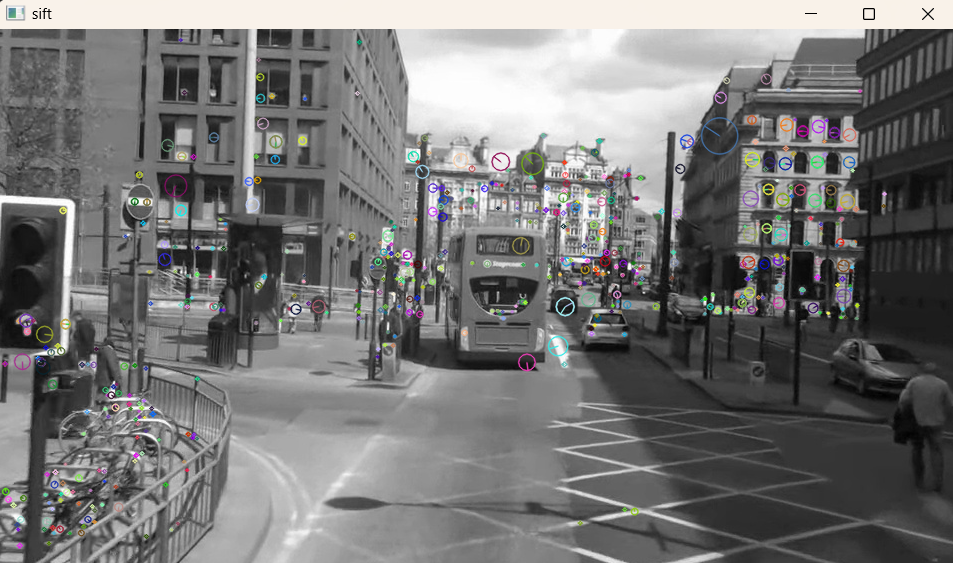

# L06_Local Feature_Homework

## 01 **SIFT 알고리즘을 이용한 특징점 검출 및 결과 시각화**

### 1. 요구사항

- 주어진 이미지(mot_color70.jpg)를 이용하여 `cv.imread()`를 사용하여 이미지를 불러온다.
- `cv.SIFT_create()`를 사용하여 SIFT 객체를 생성한다.
- `detectAndCompute()`를 사용하여 특징점을 검출한다.
- `cv.drawKeypoints()`를 사용하여 검출된 특징점을 이미지에 시각화한다.
- `matplotlib.pyplot`을 사용하여 원본 이미지와 특징점이 시각화된 이미지를 나란히 출력한다.

### 2. 코드

```python
import cv2 as cv
import matplotlib.pyplot as plt

# 이미지 불러오기 및 그레이스케일 변환
img = cv.imread('mot_color70.jpg')    # 영상 읽기
gray = cv.cvtColor(img, cv.COLOR_BGR2GRAY)

# SIFT 객체 생성 (특징점 개수 제한 가능)
sift = cv.SIFT_create(nfeatures=700)
kp, des = sift.detectAndCompute(gray, None)

# 특징점 시각화
gray = cv.drawKeypoints(gray, kp, None, flags=cv.DRAW_MATCHES_FLAGS_DRAW_RICH_KEYPOINTS)
cv.imshow('SIFT Keypoints', gray)

# 결과 출력
plt.figure(figsize=(10, 6))

# 원본 이미지
plt.subplot(1, 2, 1)
plt.imshow(cv.cvtColor(img, cv.COLOR_BGR2RGB))  # BGR 형식이므로 RGB로 변환
plt.title("Original Image")
plt.axis("off")

# 특징점 시각화 이미지
plt.subplot(1, 2, 2)
plt.imshow(gray)
plt.title("SIFT Keypoints")
plt.axis("off")

plt.show()
```

### 3. 코드 설명

### (1) 이미지 불러오기 및 그레이스케일 변환

```python
img = cv.imread('mot_color70.jpg')
gray = cv.cvtColor(img, cv.COLOR_BGR2GRAY)
```

- `cv.imread()`를 사용하여 이미지를 불러온다.
- `cv.cvtColor()`를 사용하여 컬러 이미지를 그레이스케일로 변환한다.

### (2) SIFT 객체 생성 및 특징점 검출

```python
sift = cv.SIFT_create(nfeatures=700)
kp, des = sift.detectAndCompute(gray, None)
```

- `cv.SIFT_create()`를 사용하여 SIFT 객체를 생성합니다. `nfeatures=700`은 최대 700개의 특징점을 검출하겠다는 의미이다.
- `detectAndCompute()`를 사용하여 특징점을 검출하고, 해당 특징점의 디스크립터(descriptors)를 계산합니다. 이 디스크립터는 각 특징점을 고유하게 식별할 수 있는 특징 벡터이다.

### (3) 특징점 시각화

```python
gray = cv.drawKeypoints(gray, kp, None, flags=cv.DRAW_MATCHES_FLAGS_DRAW_RICH_KEYPOINTS)
```

- `cv.drawKeypoints()`를 사용하여 검출된 특징점을 원본 이미지에 시각화한다. `flags=cv.DRAW_MATCHES_FLAGS_DRAW_RICH_KEYPOINTS`를 설정하면 각 특징점의 방향과 크기도 함께 표시된다.

### (4) 결과 시각화

```python
plt.figure(figsize=(10, 6))

# 원본 이미지
plt.subplot(1, 2, 1)
plt.imshow(cv.cvtColor(img, cv.COLOR_BGR2RGB))
plt.title("Original Image")
plt.axis("off")

# 특징점 시각화 이미지
plt.subplot(1, 2, 2)
plt.imshow(gray)
plt.title("SIFT Keypoints")
plt.axis("off")

plt.show()
```

- `matplotlib.pyplot`을 사용하여 원본 이미지와 특징점이 시각화된 이미지를 나란히 출력한다. `cv.cvtColor()`를 사용하여 BGR 형식의 이미지를 RGB 형식으로 변환하여 정확한 색상으로 표시한다.

### 5. 결과




- **Original Image**: 원본 이미지가 왼쪽에 표시됩니다. 이 이미지는 색상 정보가 포함된 상태로 표시된다.
- **SIFT Keypoints**: 오른쪽에는 SIFT 알고리즘을 통해 검출된 특징점들이 시각화된 이미지가 표시됩니다. 각 특징점은 원과 선으로 표시되며, 크기와 방향 정보도 함께 나타난다.

**SIFT 알고리즘**을 사용하여 이미지에서 강건한 특징점을 효과적으로 검출할 수 있음을 확인할 수 있다. 특징점은 회전, 크기 변화, 조명 변화에 대해서도 강건하여 이미지 분석 및 객체 인식에 유용하다.

### 

## 02 **SIFT를 이용한 두 영상 간 특징점 매칭**

### 1. 요구사항

- 주어진 두 이미지 **(mot_color70.jpg, mot_color83.jpg)** 를 이용하여 **SIFT 특징점** 기반으로 매칭을 수행하고 결과를 시각화한다.
- `cv.imread()`를 사용하여 두 개의 이미지를 불러옵니다.
- `cv.SIFT_create()`를 사용하여 각 이미지의 특징점을 추출한다.
- `cv.BFMatcher()` 또는 `cv.FlannBasedMatcher()`를 사용하여 두 영상 간 특징점을 매칭한다.
- `cv.drawMatches()`를 사용하여 매칭된 특징점들을 이미지에 시각화한다.
- `matplotlib.pyplot`을 사용하여 매칭 결과를 출력한다.

### 2. 코드

```python
import cv2 as cv
import numpy as np
import matplotlib.pyplot as plt

# 이미지 불러오기
img1 = cv.imread("mot_color70.jpg")
img2 = cv.imread("mot_color83.jpg")
img1_rgb = cv.cvtColor(img1, cv.COLOR_BGR2RGB)
img2_rgb = cv.cvtColor(img2, cv.COLOR_BGR2RGB)

# SIFT 특징점 검출기 생성
sift = cv.SIFT_create()
kp1, des1 = sift.detectAndCompute(img1, None)
kp2, des2 = sift.detectAndCompute(img2, None)
print('특징점 개수:', len(kp1), len(kp2))

# BFMatcher 객체 생성 및 매칭 수행
bf = cv.BFMatcher(cv.NORM_L2, crossCheck=True)
matches = bf.match(des1, des2)

# 매칭 결과 정렬
matches = sorted(matches, key=lambda x: x.distance)

# 매칭 결과 이미지 그리기
draw_params = dict(flags=cv.DrawMatchesFlags_NOT_DRAW_SINGLE_POINTS)
img_matches = cv.drawMatches(img1_rgb, kp1, img2_rgb, kp2, matches[:50], None, **draw_params)

# 결과 출력
plt.figure(figsize=(12, 6))
plt.imshow(img_matches, cmap='gray')
plt.title('SIFT Feature Matching')
plt.axis('off')
plt.show()
```

### 3. 코드 설명

### (1) 이미지 불러오기

```python
img1 = cv.imread("mot_color70.jpg")
img2 = cv.imread("mot_color83.jpg")
img1_rgb = cv.cvtColor(img1, cv.COLOR_BGR2RGB)
img2_rgb = cv.cvtColor(img2, cv.COLOR_BGR2RGB)
```

- `cv.imread()`를 사용하여 두 개의 이미지를 불러옵니다.
- 이미지는 기본적으로 **BGR** 형식으로 불러오기 때문에, 이를 **RGB** 형식으로 변환하기 위해 `cv.cvtColor()`를 사용하여 색상 형식을 변경합니다.

### (2) SIFT 객체 생성 및 특징점 검출

```python
sift = cv.SIFT_create()
kp1, des1 = sift.detectAndCompute(img1, None)
kp2, des2 = sift.detectAndCompute(img2, None)
```

- `cv.SIFT_create()`를 사용하여 **SIFT 객체**를 생성한다.
- `detectAndCompute()` 메서드를 사용하여 이미지에서 특징점(`kp1`, `kp2`)을 검출하고, 각 특징점에 대한 디스크립터(`des1`, `des2`)를 계산합니다. 디스크립터는 각 특징점의 고유한 특징을 나타내는 벡터이다.

### (3) BFMatcher 객체 생성 및 매칭 수행

```python
bf = cv.BFMatcher(cv.NORM_L2, crossCheck=True)
matches = bf.match(des1, des2)
```

- `cv.BFMatcher()`를 사용하여 **Brute-Force 매처**를 생성한다. `cv.NORM_L2`는 거리 측정 방식을 **유클리드 거리**로 설정하며, 이때 `crossCheck=True`는 매칭이 양방향에서 모두 유효해야만 유효한 매칭으로 고려하는 조건이다.
- `bf.match()` 메서드를 사용하여 두 이미지의 특징점 디스크립터를 비교하고 매칭을 수행한다.

### (4) 매칭 결과 정렬 및 시각화

```python
matches = sorted(matches, key=lambda x: x.distance)
```

- 매칭된 결과를 **거리(distance)** 기준으로 오름차순으로 정렬하여 가장 좋은 매칭을 먼저 표시할 수 있도록 한다.

```python
draw_params = dict(flags=cv.DrawMatchesFlags_NOT_DRAW_SINGLE_POINTS)
img_matches = cv.drawMatches(img1_rgb, kp1, img2_rgb, kp2, matches[:50], None, **draw_params)
```

- `cv.drawMatches()`를 사용하여 두 이미지 간의 매칭된 특징점을 시각화한다. 매칭된 특징점은 선으로 연결되며, `flags=cv.DrawMatchesFlags_NOT_DRAW_SINGLE_POINTS`를 설정하여 특징점만 연결된 이미지를 생성한다.

### (5) 매칭 결과 출력

```python
plt.figure(figsize=(12, 6))
plt.imshow(img_matches, cmap='gray')
plt.title('SIFT Feature Matching')
plt.axis('off')
plt.show()
```

- `matplotlib.pyplot`을 사용하여 매칭 결과 이미지를 출력합니다. 이미지는 50개의 매칭된 특징점만을 표시하며, 결과적으로 두 이미지 간의 유사한 부분을 시각적으로 확인할 수 있습니다.

### 4. 결과

- **SIFT Feature Matching**: 두 이미지를 비교하여 SIFT 알고리즘을 통해 추출된 특징점들이 어떻게 매칭되었는지를 나타내는 시각적 결과입니다. 매칭된 특징점들은 선으로 연결되며, 두 이미지 간 유사한 영역을 강조합니다.

### 5. 실행 결과


- **매칭된 특징점**: 두 이미지의 특징점들이 선으로 연결되어 매칭된 결과가 시각적으로 표시된다.

## 03 **호모그래피를 이용한 이미지 정합 (Image Alignment)**

### 1. 요구사항

- `cv.imread()`를 사용하여 두 이미지를 불러온다.
- `cv.SIFT_create()`를 사용하여 SIFT 객체를 생성하고, 두 이미지에서 특징점을 검출한다.
- `cv.BFMatcher()`를 사용하여 특징점을 매칭한다.
- `cv.findHomography()`와 `cv.RANSAC`을 이용하여 호모그래피 행렬을 계산한다.
- `cv.warpPerspective()`를 사용하여 정렬 대상 이미지를 기준 이미지에 맞게 변환한다.

---

### 2. 코드

```python
import cv2 as cv
import numpy as np
import matplotlib.pyplot as plt

# 이미지 불러오기
img1 = cv.imread('img1.jpg')   # 기준 이미지
img2 = cv.imread('img2.jpg')   # 정렬할 이미지

# 그레이스케일 변환
gray1 = cv.cvtColor(img1, cv.COLOR_BGR2GRAY)
gray2 = cv.cvtColor(img2, cv.COLOR_BGR2GRAY)

# SIFT 객체 생성 및 특징점 검출
sift = cv.SIFT_create()
kp1, des1 = sift.detectAndCompute(gray1, None)
kp2, des2 = sift.detectAndCompute(gray2, None)

# BFMatcher로 매칭 수행
bf = cv.BFMatcher()
matches = bf.knnMatch(des1, des2, k=2)

# ratio test로 좋은 매칭점 선별
good_matches = []
for m, n in matches:
    if m.distance < 0.75 * n.distance:
        good_matches.append(m)

# 최소 매칭점 수 검사
if len(good_matches) > 4:
    # 좋은 매칭점에서 좌표 추출
    src_pts = np.float32([kp1[m.queryIdx].pt for m in good_matches]).reshape(-1, 1, 2)
    dst_pts = np.float32([kp2[m.trainIdx].pt for m in good_matches]).reshape(-1, 1, 2)

    # 호모그래피 계산 (RANSAC 사용)
    H, mask = cv.findHomography(dst_pts, src_pts, cv.RANSAC)

    # img2를 img1 기준으로 변환
    h, w = img1.shape[:2]
    aligned_img = cv.warpPerspective(img2, H, (w, h))

    # 결과 출력 (원본, 변환된 이미지 비교)
    stacked = np.hstack((img1, aligned_img))
    cv.imshow('Original (Left) vs Aligned (Right)', stacked)
    cv.waitKey(0)
    cv.destroyAllWindows()

```

---

### 3. 코드 설명

### (1) 이미지 불러오기 및 그레이스케일 변환

```python
img1 = cv.imread('img1.jpg')
img2 = cv.imread('img2.jpg')
gray1 = cv.cvtColor(img1, cv.COLOR_BGR2GRAY)
gray2 = cv.cvtColor(img2, cv.COLOR_BGR2GRAY)
```

- `cv.imread()`를 사용하여 두 이미지(img1, img2)를 불러오고,
- `cv.cvtColor()`를 통해 그레이스케일로 변환하여 특징점 검출을 용이하게 한다.

### (2) SIFT 특징점 검출

```python
sift = cv.SIFT_create()
kp1, des1 = sift.detectAndCompute(gray1, None)
kp2, des2 = sift.detectAndCompute(gray2, None)
```

- `cv.SIFT_create()`로 SIFT 객체를 생성하고,
- `detectAndCompute()`를 통해 키포인트와 디스크립터를 추출한다.

### (3) 특징점 매칭 및 ratio test

```python
bf = cv.BFMatcher()
matches = bf.knnMatch(des1, des2, k=2)

good_matches = []
for m, n in matches:
    if m.distance < 0.75 * n.distance:
        good_matches.append(m)

```

- BFMatcher를 이용한 k-NN 매칭과 ratio test를 통해 신뢰도 높은 매칭점만을 필터링한다. 이때 임계값은 0.75로 설정한다.

### (4) 호모그래피 계산 및 이미지 정렬

```python
H, mask = cv.findHomography(dst_pts, src_pts, cv.RANSAC)
aligned_img = cv.warpPerspective(img2, H, (w, h))
```

- `cv.findHomography()`와 RANSAC 알고리즘을 통해 이상점을 제거하고,
- `cv.warpPerspective()`를 사용하여 img2를 img1 기준으로 투영 변환한다.

### (5) 결과 시각화

```python
stacked = np.hstack((img1, aligned_img))
cv.imshow('Original (Left) vs Aligned (Right)', stacked)
```

- `np.hstack()`을 이용하여 정렬 전/후 이미지를 나란히 보여준다.

---

### 4. 실행 결과


SIFT 알고리즘과 호모그래피 계산을 통해 이미지 간의 대응 관계를 추정하고, 정합된 결과를 시각적으로 확인할 수 있다.