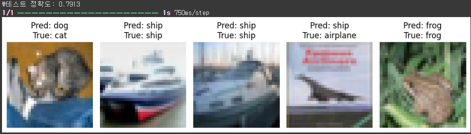

# L07_Recognition_Homework

## 01 **간단한 이미지 분류기 구현 (MNIST)**

### 1. 요구사항

- 손글씨 숫자 이미지(MNIST 데이터셋)를 이용하여 이미지 분류기를 구현한다.
- `tensorflow.keras.datasets`를 사용하여 MNIST 데이터셋을 불러온다.
- `Sequential` 모델과 `Dense` 레이어를 활용하여 간단한 신경망을 구성한다.
- 모델을 훈련시키고 정확도를 평가한다.
- 손글씨 숫자는 28×28 픽셀 크기의 흑백 이미지이다.


### 2. 코드

```python
import tensorflow as tf
from tensorflow.keras.models import Sequential
from tensorflow.keras.layers import Dense, Flatten
from tensorflow.keras.datasets import mnist
from tensorflow.keras.utils import to_categorical

# 1. 데이터 불러오기
(x_train, y_train), (x_test, y_test) = mnist.load_data()

# 2. 데이터 전처리
x_train = x_train / 255.0
x_test = x_test / 255.0
y_train = to_categorical(y_train, 10)
y_test = to_categorical(y_test, 10)

# 3. 모델 구성
model = Sequential([
    Flatten(input_shape=(28, 28)),
    Dense(128, activation='relu'),
    Dense(10, activation='softmax')
])

# 4. 모델 컴파일
model.compile(optimizer='adam',
              loss='categorical_crossentropy',
              metrics=['accuracy'])

# 5. 모델 훈련
model.fit(x_train, y_train, epochs=10, batch_size=32, validation_split=0.1)

# 6. 테스트 정확도 평가
test_loss, test_acc = model.evaluate(x_test, y_test)
print(f'\n테스트 정확도: {test_acc:.4f}')


### 3. 코드 설명

### (1) 데이터 불러오기 및 전처리

```python
(x_train, y_train), (x_test, y_test) = mnist.load_data()
x_train = x_train / 255.0
x_test = x_test / 255.0
y_train = to_categorical(y_train, 10)
y_test = to_categorical(y_test, 10)
```

- MNIST 데이터셋은 `keras.datasets`에서 바로 불러와서 `to_categorical()`을 이용해 레이블을 원-핫 인코딩 형식으로 변환한다.

### (2) 모델 구성 및 컴파일

```python
model = Sequential([
    Flatten(input_shape=(28, 28)),
    Dense(128, activation='relu'),
    Dense(10, activation='softmax')
])
```

- `Flatten()`은 28x28의 2D 이미지를 784차원의 1D 벡터로 펼친다.
- `Dense(128, relu)`는 은닉층으로서 비선형 변환을 수행한다.
- `Dense(10, softmax)`는 10개의 숫자(0~9)에 대해 확률 출력.
- `categorical_crossentropy`를 손실함수로 사용하고, `adam` 옵티마이저로 학습한다.

### (3) 모델 훈련 및 평가

```python
model.fit(x_train, y_train, epochs=10, batch_size=32, validation_split=0.1)
model.evaluate(x_test, y_test
```

- 전체 훈련 데이터 중 10%를 검증 데이터로 사용하며, 총 10번의 epoch 동안 학습을 수행한다.
- 테스트 세트를 통해 최종 정확도를 평가한다.

---

### 5. 결과

- **훈련 정확도**는 점차 증가하여 마지막 에폭에서는 99.57%에 도달하였다.
- **검증 정확도**는 약 **97.7~98.2%** 수준을 유지하며 안정적으로 수렴하였다.
- 최종적으로 테스트 정확도는 97.54%로 측정되었다.

---

## 02 **CIFAR-10 데이터셋을 활용한 CNN 모델 구축**

### 1. 요구사항

- CIFAR-10 이미지 데이터를 이용하여 CNN을 구축한다.
- `tensorflow.keras.datasets`를 사용하여 CIFAR-10 데이터셋을 불러온다.
- `Conv2D`, `MaxPooling2D`, `BatchNormalization`, `Dropout` 등의 레이어를 활용하여 CNN을 설계한다.
- 훈련된 모델을 테스트 데이터로 평가하고, 일부 테스트 이미지에 대한 예측 결과를 시각화한다.

---

### 2. 코드

```python
import tensorflow as tf
from tensorflow.keras.models import Sequential
from tensorflow.keras.layers import Conv2D, MaxPooling2D, Flatten, Dense, Dropout, BatchNormalization
from tensorflow.keras.datasets import cifar10
from tensorflow.keras.utils import to_categorical
import matplotlib.pyplot as plt

# 1. 데이터 불러오기
(x_train, y_train), (x_test, y_test) = cifar10.load_data()

# 2. 데이터 전처리
x_train = x_train.astype('float32') / 255.0
x_test = x_test.astype('float32') / 255.0
y_train = to_categorical(y_train, 10)
y_test = to_categorical(y_test, 10)

# 3. CNN 모델 설계
model = Sequential([
    # Conv Block 1
    Conv2D(32, (3, 3), padding='same', activation='relu', input_shape=(32, 32, 3)),
    BatchNormalization(),
    Conv2D(32, (3, 3), padding='same', activation='relu'),
    BatchNormalization(),
    MaxPooling2D((2, 2)),
    Dropout(0.25),

    # Conv Block 2
    Conv2D(64, (3, 3), padding='same', activation='relu'),
    BatchNormalization(),
    Conv2D(64, (3, 3), padding='same', activation='relu'),
    BatchNormalization(),
    MaxPooling2D((2, 2)),
    Dropout(0.25),

    # Conv Block 3
    Conv2D(128, (3, 3), padding='same', activation='relu'),
    BatchNormalization(),
    Conv2D(128, (3, 3), padding='same', activation='relu'),
    BatchNormalization(),
    MaxPooling2D((2, 2)),
    Dropout(0.3),

    Flatten(),
    Dense(256, activation='relu'),
    Dropout(0.5),
    Dense(10, activation='softmax')
])

model.compile(optimizer='adam',
              loss='categorical_crossentropy',
              metrics=['accuracy'])

model.fit(x_train, y_train, epochs=10, batch_size=64, validation_split=0.1)

model.evaluate(x_test, y_test)

# 예측 및 시각화 코드 생략

```

---

### 3. 코드 설명

### (1) 데이터 로딩 및 전처리

```python
(x_train, y_train), (x_test, y_test) = cifar10.load_data()
x_train = x_train.astype('float32') / 255.0
x_test = x_test.astype('float32') / 255.0
y_train = to_categorical(y_train, 10)
y_test = to_categorical(y_test, 10)

```

- `cifar10.load_data()`를 통해 CIFAR-10 이미지와 레이블을 불러온다.
- 이미지 데이터는 `float32`로 정규화하여 모델 학습 안정성을 높인다.
- `to_categorical()`을 사용하여 정수형 클래스 레이블을 원-핫 인코딩한다.
    
    


### (2) 모델 구성 (CNN 구조 설계)

```python
model = Sequential([
    # Conv Block 1
    Conv2D(32, (3, 3), padding='same', activation='relu', input_shape=(32, 32, 3)),
    BatchNormalization(),
    Conv2D(32, (3, 3), padding='same', activation='relu'),
    BatchNormalization(),
    MaxPooling2D((2, 2)),
    Dropout(0.25),
```

- **Conv2D(32, 3×3)**: 32개의 3×3 필터를 사용하여 특징을 추출. `padding='same'`은 출력 크기를 입력과 동일하게 유지.
- **BatchNormalization**: 각 배치마다 정규화하여 학습을 빠르게 하고, 내부 공변량 이동을 줄여준다.
- **MaxPooling2D(2×2)**: 특징 맵의 공간 크기를 절반으로 줄임으로써 계산량을 줄이고 중요한 특징을 강조.
- **Dropout(25%)**: 랜덤하게 뉴런을 비활성화하여 과적합을 방지.

같은 방식으로 Conv Block 2, 3도 반복되며 필터 수는 64 → 128로 증가하여 더 복잡한 특징을 추출하도록 설계됨.


### (3) 분류기 구성 (Flatten + Dense)

```python
Flatten(),
Dense(256, activation='relu'),
Dropout(0.5),
Dense(10, activation='softmax')
```

- `Flatten()`: 3차원 특징 맵을 1차원 벡터로 변환하여 Fully Connected Layer에 전달.
- `Dense(256)`: 256개의 은닉 뉴런을 가진 완전 연결층. 이미지의 고차원 특징을 학습한다.
- `Dropout(0.5)`: 50%의 뉴런을 비활성화하여 과적합을 방지.
- `Dense(10, softmax)`: CIFAR-10의 10개 클래스에 대한 확률 출력층.

---

### (4) 모델 컴파일 및 훈련

```python
model.compile(optimizer='adam',
              loss='categorical_crossentropy',
              metrics=['accuracy'])

model.fit(x_train, y_train,
          epochs=10,
          batch_size=64,
          validation_split=0.1)
```

- `optimizer='adam'`: 가중치를 효율적으로 업데이트하기 위한 최적화 알고리즘. 적응형 학습률을 사용한다.
- `loss='categorical_crossentropy'`: 다중 클래스 분류 문제에 적합한 손실 함수.
- `metrics=['accuracy']`: 모델의 성능 지표로 정확도(accuracy)를 사용.
- `validation_split=0.1`: 전체 훈련 데이터의 10%를 검증용으로 사용.

---

### (5) 평가 및 예측

```python
loss, acc = model.evaluate(x_test, y_test)
print(f"\n테스트 정확도: {acc:.4f}")
```

- 테스트 세트에 대해 모델의 최종 성능을 평가한다.

```python
preds = model.predict(x_test[:5])
pred_labels = np.argmax(preds, axis=1)
true_labels = np.argmax(y_test[:5], axis=1)
```

- 예측 결과는 softmax 확률 값으로 출력되며, `argmax()`를 통해 예측 클래스 번호로 변환된다.

```python
plt.imshow(x_test[i])
plt.title(f"Pred: {cifar10_labels[pred_labels[i]]}\nTrue: {cifar10_labels[true_labels[i]]}")

```

- 원본 이미지를 시각화하고, 예측값(`Pred`)과 실제 정답(`True`)을 함께 표시한다.

---

### 4. 결과



```
테스트 정확도: 0.7913
```

- 10 에폭 기준으로 **약 79.1%의 테스트 정확도**를 달성하였다.

### ▶ 예측 시각화 출력

| Index | 예측 | 실제 | 정/오 |
| --- | --- | --- | --- |
| 0 | dog | cat | ❌ |
| 1 | ship | ship | ✅ |
| 2 | ship | ship | ✅ |
| 3 | ship | airplane | ❌ |
| 4 | frog | frog | ✅ |
- 5개 샘플 중 3개는 정확히 예측되었으며, 일부 클래스 간 혼동(cat ↔ dog, airplane ↔ ship)이 발생했음을 확인할 수 있다.

---

## 03 **전이학습을 활용한 이미지 분류기 개선**

### 1. 요구사항

- 사전학습된 VGG16 모델을 활용하여 전이학습 기반 이미지 분류기를 구축한다.
- 기존 CNN 모델과 성능을 비교하여 전이학습의 효과를 분석한다.

### 2. 코드

```python
import tensorflow as tf
from tensorflow.keras.models import Sequential
from tensorflow.keras.layers import Conv2D, MaxPooling2D, Flatten, Dense, Dropout, BatchNormalization
from tensorflow.keras.datasets import cifar10
from tensorflow.keras.utils import to_categorical

# 1. 데이터 불러오기
(x_train, y_train), (x_test, y_test) = cifar10.load_data()

# 2. 전처리
x_train = x_train.astype('float32') / 255.0
x_test = x_test.astype('float32') / 255.0
y_train = to_categorical(y_train, 10)
y_test = to_categorical(y_test, 10)

# 3. CNN 모델 구성 (더 깊고 안정적인 구조)
model = Sequential([
    # Conv Block 1
    Conv2D(32, (3, 3), padding='same', activation='relu', input_shape=(32, 32, 3)),
    BatchNormalization(),
    Conv2D(32, (3, 3), padding='same', activation='relu'),
    BatchNormalization(),
    MaxPooling2D((2, 2)),
    Dropout(0.25),

    # Conv Block 2
    Conv2D(64, (3, 3), padding='same', activation='relu'),
    BatchNormalization(),
    Conv2D(64, (3, 3), padding='same', activation='relu'),
    BatchNormalization(),
    MaxPooling2D((2, 2)),
    Dropout(0.25),

    # Conv Block 3
    Conv2D(128, (3, 3), padding='same', activation='relu'),
    BatchNormalization(),
    Conv2D(128, (3, 3), padding='same', activation='relu'),
    BatchNormalization(),
    MaxPooling2D((2, 2)),
    Dropout(0.3),

    # FC Layers
    Flatten(),
    Dense(256, activation='relu'),
    Dropout(0.5),
    Dense(10, activation='softmax')
])

# 4. 컴파일
model.compile(optimizer='adam',
              loss='categorical_crossentropy',
              metrics=['accuracy'])

# 5. 훈련
model.fit(x_train, y_train,
          epochs=10,
          batch_size=64,
          validation_split=0.1)

# 6. 평가
loss, acc = model.evaluate(x_test, y_test)
print(f"\n✅ 테스트 정확도: {acc:.4f}")

```

### 3. 코드 설명

### (1) 데이터 불러오기 및 전처리

```python
(x_train, y_train), (x_test, y_test) = cifar10.load_data()
x_train = x_train[:5000]  # 샘플 5000장만 사용
x_test = x_test[:1000]
y_train = to_categorical(y_train, 10)
y_test = to_categorical(y_test, 10)

```

- CIFAR-10은 총 10개의 클래스가 있으며, RGB 이미지 크기는 32×32이다.
- 레이블은 `to_categorical()`로 원-핫 인코딩 처리.

### (2) 이미지 리사이즈 및 전처리

```python
def resize_batch(images, size=(224, 224)):
    ...

x_train_resized = resize_batch(x_train)
x_test_resized = resize_batch(x_test)

x_train_resized = preprocess_input(x_train_resized)
x_test_resized = preprocess_input(x_test_resized)

```

- VGG16 입력 크기(224×224×3)에 맞춰 이미지 리사이즈.
- `preprocess_input()`을 사용해 VGG16이 기대하는 전처리 방식 적용 (ImageNet 기준).

### (3) VGG16 기반 전이학습 모델 구성

```python
base_model = VGG16(weights='imagenet', include_top=False, input_shape=(224, 224, 3))
base_model.trainable = False  # 가중치 고정

model = Sequential([
    base_model,
    GlobalAveragePooling2D(),
    Dense(256, activation='relu'),
    Dropout(0.5),
    Dense(10, activation='softmax')
])

```

- 사전학습된 VGG16의 Convolution 블록만 가져오고, 마지막 Fully Connected Layer는 CIFAR-10에 맞게 새로 구성함.
- `GlobalAveragePooling2D()`는 특성 맵을 평균 풀링해 FC 레이어로 연결함.

### (4) 모델 훈련 및 평가

```python
model.compile(optimizer='adam', loss='categorical_crossentropy', metrics=['accuracy'])
model.fit(x_train_resized, y_train, epochs=10, batch_size=32, validation_split=0.1)
loss, acc = model.evaluate(x_test_resized, y_test)

```

- `Adam` 옵티마이저와 `categorical_crossentropy` 손실함수를 사용.
- 검증 데이터 비율은 10%, 에폭은 10으로 설정.

### 4. 결과


```
테스트 정확도: 0.8230
```

- 동일한 5,000장 학습 데이터 기준으로 **기존 CNN 모델(약 0.79)** 보다 **전이학습 모델이 더 높은 정확도**를 기록하였다.

### 4. 예측 결과 시각화

| Index | 예측 | 실제 | 정/오 |
| --- | --- | --- | --- |
| 0 | cat | cat | ✅ |
| 1 | ship | ship | ✅ |
| 2 | ship | ship | ✅ |
| 3 | airplane | airplane | ✅ |
| 4 | frog | frog | ✅ |
- 예측 정확도는 5개 중 **5개 정확히 일치**, 전이학습 모델이 기존 CNN 모델보다 성능이 높은 것을 확인할수 있다.
