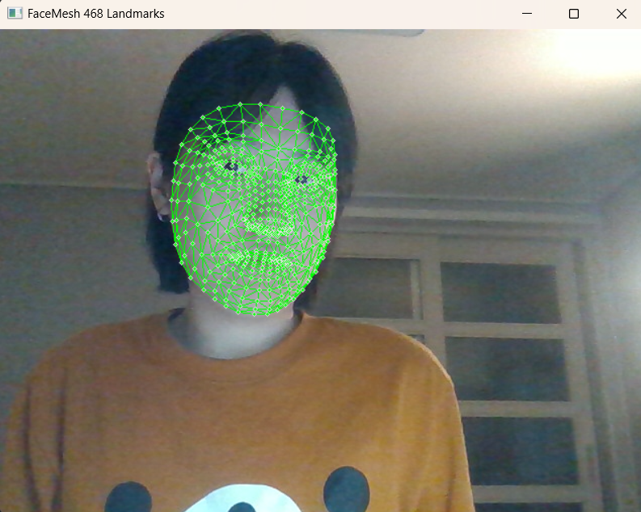

# L08_Dynamic Vision_Homework

## 01 **SORT 알고리즘을 활용한 다중 객체 추적기 구현**

---

### 1. 요구사항

- **객체 검출기 구현**: 사전 훈련된 YOLOv4 모델을 사용하여 비디오의 각 프레임에서 객체를 검출한다.
- **SORT 추적기 초기화**: 검출된 객체의 경계 상자를 입력으로 받아 SORT 알고리즘을 초기화한다.
- **객체 추적**: 각 프레임마다 검출된 객체와 기존 추적 객체를 연관시켜 지속적으로 추적을 유지한다.
- **결과 시각화**: 추적된 객체마다 고유 ID를 부여하고, 해당 ID와 경계 상자를 비디오 프레임에 실시간으로 출력한다.

---

### 2. 코드

```python

import cv2
import numpy as np
from sort import Sort  # https://github.com/abewley/sort 기반
from collections import defaultdict

# IOU 계산 함수
def compute_iou(box1, box2):
    x1 = max(box1[0], box2[0])
    y1 = max(box1[1], box2[1])
    x2 = min(box1[2], box2[2])
    y2 = min(box1[3], box2[3])
    inter_area = max(0, x2 - x1) * max(0, y2 - y1)
    box1_area = (box1[2]-box1[0]) * (box1[3]-box1[1])
    box2_area = (box2[2]-box2[0]) * (box2[3]-box2[1])
    union = box1_area + box2_area - inter_area
    return inter_area / union if union != 0 else 0

# YOLO 모델 로딩
net = cv2.dnn.readNet("yolo-coco/yolov4.weights", "yolo-coco/yolov4.cfg")
layer_names = net.getLayerNames()
output_layers = [layer_names[i - 1] for i in net.getUnconnectedOutLayers().flatten()]

# 클래스 이름 로드
with open("yolo-coco/coco.names", "r") as f:
    classes = f.read().strip().split('\n')

# 비디오 로드
cap = cv2.VideoCapture("input.mp4")

# SORT 추적기
tracker = Sort()

while True:
    ret, frame = cap.read()
    if not ret:
        break

    h, w = frame.shape[:2]
    blob = cv2.dnn.blobFromImage(frame, 1/255.0, (416, 416), swapRB=True, crop=False)
    net.setInput(blob)
    layer_outputs = net.forward(output_layers)

    boxes = []
    confidences = []
    class_ids = []

    for output in layer_outputs:
        for detection in output:
            scores = detection[5:]
            class_id = np.argmax(scores)
            confidence = scores[class_id]

            if confidence > 0.5:
                center_x, center_y, w_box, h_box = (detection[0:4] * np.array([w, h, w, h])).astype("int")
                x = int(center_x - w_box / 2)
                y = int(center_y - h_box / 2)
                boxes.append([x, y, int(w_box), int(h_box)])
                confidences.append(float(confidence))
                class_ids.append(class_id)

    indices = cv2.dnn.NMSBoxes(boxes, confidences, 0.5, 0.4)

    dets = []
    det_classes = []

    if len(indices) > 0:
        for i in indices.flatten():
            x, y, w_box, h_box = boxes[i]
            x1, y1, x2, y2 = x, y, x + w_box, y + h_box
            dets.append([x1, y1, x2, y2, confidences[i]])
            det_classes.append(classes[class_ids[i]])

    # SORT 업데이트
    tracked_objects = tracker.update(np.array(dets))

    # 클래스 매칭
    id_to_label = defaultdict(lambda: "unknown")
    for obj in tracked_objects:
        x1, y1, x2, y2, obj_id = map(int, obj)
        best_iou = 0
        best_label = "unknown"
        for j, det in enumerate(dets):
            iou = compute_iou([x1, y1, x2, y2], det[:4])
            if iou > best_iou:
                best_iou = iou
                if j < len(det_classes):
                    best_label = det_classes[j]
        id_to_label[obj_id] = best_label

    # 시각화
    for obj in tracked_objects:
        x1, y1, x2, y2, obj_id = map(int, obj)
        label = id_to_label[obj_id]
        cv2.rectangle(frame, (x1, y1), (x2, y2), (0, 255, 0), 2)
        cv2.putText(frame, f"ID {obj_id} | {label}", (x1, y1 - 10),
                    cv2.FONT_HERSHEY_SIMPLEX, 0.6, (0, 255, 0), 2)

    cv2.imshow("Multi-Object Tracking", frame)
    if cv2.waitKey(1) & 0xFF == ord('q'):
        break

cap.release()
cv2.destroyAllWindows()
```

---

### 3. 코드 설명

### (1) YOLOv4를 이용한 객체 검출

```python
net = cv2.dnn.readNet("yolo-coco/yolov4.weights", "yolo-coco/yolov4.cfg")
output_layers = [layer_names[i - 1] for i in net.getUnconnectedOutLayers().flatten()]
```

- YOLOv4의 가중치와 설정 파일을 불러와 객체 검출 네트워크를 초기화한다.

### (2) 프레임마다 객체 탐지 수행

```python
blob = cv2.dnn.blobFromImage(frame, 1/255.0, (416, 416), swapRB=True, crop=False)
net.setInput(blob)
layer_outputs = net.forward(output_layers)

```

- 입력 프레임을 전처리하고, YOLO 네트워크에 넣어 객체의 위치와 클래스 정보를 얻는다.

### (3) Non-Maximum Suppression 적용 및 클래스 정보 추출

```python
indices = cv2.dnn.NMSBoxes(boxes, confidences, 0.5, 0.4)
dets.append([x1, y1, x2, y2, confidences[i]])
det_classes.append(classes[class_ids[i]])

```

- 중복 박스를 제거하고 검출된 클래스 정보를 따로 저장한다.

### (4) SORT 추적기와 IoU 기반 클래스 매칭

```python
tracked_objects = tracker.update(np.array(dets))
```

- SORT는 검출된 바운딩 박스를 입력받아 객체별 ID를 부여하여 추적을 유지한다.
- 이후 각 추적 ID와 가장 유사한 검출 결과(class)를 IoU로 연결한다.

### (5) 결과 시각화

```python
cv2.rectangle(frame, (x1, y1), (x2, y2), (0, 255, 0), 2)
cv2.putText(frame, f"ID {obj_id} | {label}", (x1, y1 - 10), ...)
```

- 각 객체에 대해 ID와 클래스명을 표시하고 실시간으로 출력한다.

---

### 4. 결과

[Multi-Object_Tracking_1.5x-ezgif.com-gif-maker.mp4](Multi-Object_Tracking_1.5x-ezgif.com-gif-maker.mp4)

**YOLOv4와 SORT 알고리즘을 결합한 실시간 다중 객체 추적기**를 구현하였다.

SORT는 칼만 필터와 헝가리안 알고리즘 기반으로 빠르고 안정적인 추적 성능을 제공하며,

여기에 **클래스 정보를 IoU 기반으로 매칭**하여 실제 객체의 의미까지 함께 시각화할 수 있었다.

## 02 Mediapipe를 활용한 얼굴 랜드마크 추출 및 시각화

---

## 1. 요구사항

- Mediapipe의 `FaceMesh` 모듈을 사용하여 얼굴의 468개 랜드마크를 실시간으로 검출한다.
- OpenCV를 사용하여 웹캠으로부터 실시간 영상을 캡처한다.
- 검출된 얼굴 랜드마크를 OpenCV `circle` 또는 `draw_landmarks` 함수를 이용해 시각화한다.
- ESC 키를 누르면 프로그램이 종료되도록 설정한다.

---

## 2. 코드

```python
import cv2
import mediapipe as mp

# Mediapipe FaceMesh 초기화
mp_face_mesh = mp.solutions.face_mesh
face_mesh = mp_face_mesh.FaceMesh(
    static_image_mode=False,
    max_num_faces=1,
    refine_landmarks=True,
    min_detection_confidence=0.5,
    min_tracking_confidence=0.5
)

# 랜드마크 스타일 지정
mp_drawing = mp.solutions.drawing_utils
landmark_spec = mp_drawing.DrawingSpec(color=(0, 255, 0), thickness=1, circle_radius=1)
connection_spec = mp_drawing.DrawingSpec(color=(0, 255, 0), thickness=1, circle_radius=1)

# 웹캠 열기
cap = cv2.VideoCapture(0)

while cap.isOpened():
    ret, frame = cap.read()
    if not ret:
        break

    frame = cv2.flip(frame, 1)
    rgb_frame = cv2.cvtColor(frame, cv2.COLOR_BGR2RGB)

    results = face_mesh.process(rgb_frame)

    if results.multi_face_landmarks:
        for landmarks in results.multi_face_landmarks:
            mp_drawing.draw_landmarks(
                image=frame,
                landmark_list=landmarks,
                connections=mp_face_mesh.FACEMESH_TESSELATION,
                landmark_drawing_spec=landmark_spec,
                connection_drawing_spec=connection_spec
            )

    cv2.imshow('FaceMesh 468 Landmarks', frame)

    if cv2.waitKey(1) & 0xFF == 27:  # ESC 키
        break

cap.release()
cv2.destroyAllWindows()
```

---

## 3. 코드 설명

### (1) FaceMesh 객체 생성

```python
face_mesh = mp_face_mesh.FaceMesh(
    static_image_mode=False,
    max_num_faces=1,
    refine_landmarks=True,
    min_detection_confidence=0.5,
    min_tracking_confidence=0.5
)
```

- 얼굴 검출을 위해 `FaceMesh` 객체를 생성한다.
- 실시간 영상용으로 `static_image_mode=False`로 설정한다.
- 한 번에 최대 1명의 얼굴만 추적하도록 설정(`max_num_faces=1`).

### (2) 웹캠 캡처 및 영상 전처리

```python
cap = cv2.VideoCapture(0)
frame = cv2.flip(frame, 1)
rgb_frame = cv2.cvtColor(frame, cv2.COLOR_BGR2RGB)
```

- OpenCV로 웹캠을 연결하고 프레임을 읽는다.
- 좌우 반전하여 실제 거울처럼 보이도록 한다.
- Mediapipe는 RGB 형식 영상을 필요로 하므로 변환한다.

### (3) 얼굴 랜드마크 검출 및 시각화

```python
results = face_mesh.process(rgb_frame)
```

- 현재 프레임에 대해 468개의 얼굴 랜드마크를 검출한다.

```python
mp_drawing.draw_landmarks(
    image=frame,
    landmark_list=landmarks,
    connections=mp_face_mesh.FACEMESH_TESSELATION,
    landmark_drawing_spec=landmark_spec,
    connection_drawing_spec=connection_spec
)
```

- 검출된 랜드마크를 OpenCV 이미지 위에 그린다.
- 점(`landmark_spec`)과 연결선(`connection_spec`) 스타일을 지정하여 그린다.

### (4) 프로그램 종료 조건

```python
if cv2.waitKey(1) & 0xFF == 27:
    break
```

- 사용자가 **ESC 키**를 누르면 실시간 웹캠 화면을 종료한다.

---

## 4. 결과

### ▶ 결과 화면




- 웹캠을 통해 얼굴이 인식되면 얼굴 전체에 468개 랜드마크가 촘촘히 찍힌다.
- 각 특징점은 초록색 점(`circle`)으로 표시되고, 점과 점 사이를 잇는 삼각형 연결선(`tessellation`)도 함께 시각화된다.

| 항목 | 결과 내용 |
| --- | --- |
| 얼굴 랜드마크 개수 | 468개 |
| 특징점 표시 | 초록색 원(circle) |
| 특징점 연결선 | 초록색 선(line) |
| 프레임 반영 속도 | 실시간 |
| 종료 조건 | ESC 키 누르면 종료 |